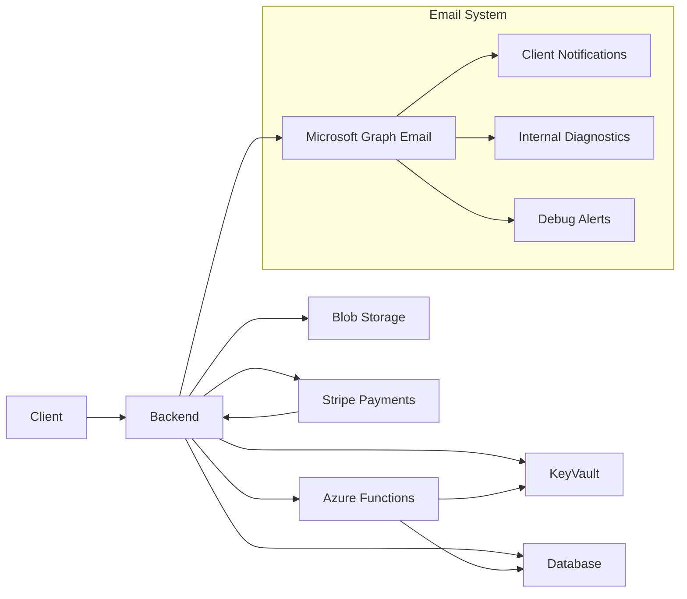

# System Architecture

This document outlines how the main components in this repository interact.

## Component Roles

- **Client (React)** – collects instruction details and initiates payments via Stripe checkout.
- **Backend (Express)** – serves APIs for the client, retrieves secrets from Azure Key Vault, processes Stripe webhooks, and manages comprehensive email notifications.
- **Database (SQL Server)** – stores instruction information and payment records.
- **Azure Key Vault** – holds connection strings, Stripe keys, and Microsoft Graph credentials for email services.
- **Azure Blob Storage** – stores uploaded documents from the client.
- **Stripe** – handles all payment processing with full webhook integration for payment lifecycle management.
- **Microsoft Graph** – powers automated email notifications with professional templates.
- **Azure Functions** – processes asynchronous tasks such as deal capture using the same Key Vault secrets.

## Email System Architecture

The application features a comprehensive email notification system:

### Email Types
- **Client Success Emails** - Professional confirmation with Stripe receipt links
- **Client Failure Emails** - Payment failure notifications with next steps
- **Bank Transfer Emails** - Detailed bank transfer instructions with proper references
- **Fee Earner Diagnostic Emails** - Complete technical reports with system state
- **Debug Stuck Client Emails** - Brief technical alerts for development team

### Email Routing
- **Development Mode**: All emails redirect to `lz@helix-law.com` and `cb@helix-law.com`
- **Production Mode**: Emails sent to actual client addresses with copy to internal team
- **Dual Recipients**: Single email sent to both recipients (visible to each other)

### Email Features
- **Litigation-grade Templates**: Professional messaging suitable for legal practice
- **Raleway Typography**: Consistent font usage across all templates
- **HLX-PASSCODE References**: Standardized short reference format
- **Stripe Receipt Integration**: Real receipt URLs from successful payments
- **Comprehensive Diagnostics**: Full system state in technical emails

## Data Flow

1. The **client** submits instruction data and file uploads to the **backend**.
2. The **backend** accesses secrets from **Key Vault** to connect to the **database**, **Blob Storage**, **Stripe**, and **Microsoft Graph**.
3. Uploaded files are saved to **Blob Storage** and instruction data is stored in the **database**.
4. For payments, the **backend** creates a Stripe PaymentIntent and handles the complete payment lifecycle via webhooks.
5. **Email notifications** are automatically triggered based on payment outcomes and system events.
6. **Stripe webhooks** process payment events, extract receipt URLs, and trigger appropriate email workflows.
7. **Debug monitoring** automatically detects stuck clients and sends technical alerts to the development team.
8. Certain events trigger **Azure Functions** which also use Key Vault secrets and may update the **database** independently of the main backend.

## Diagram

### Payment Flow

1. **Client initiates payment** via Stripe checkout
2. **Stripe processes payment** and sends webhook to backend
3. **Backend extracts receipt URL** from successful charge
4. **Email system triggers** based on payment outcome:
   - Success: Client confirmation with receipt + fee earner diagnostic
   - Failure: Client notification + admin alert + debug monitoring
5. **Reference numbers formatted** as HLX-PASSCODE for consistency

### Error Handling

- **Stripe webhook verification** ensures payment events are authentic
- **Email delivery fallback** with comprehensive error logging
- **Debug stuck client detection** for proactive issue resolution
- **Payment failure notifications** to both client and admin team
- **Comprehensive diagnostic reporting** for technical troubleshooting
