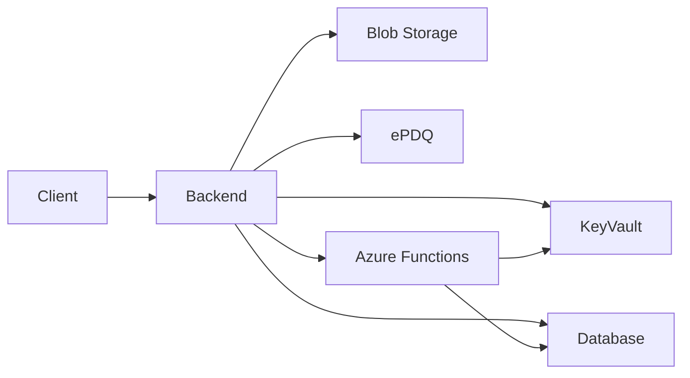

# System Architecture

This document outlines how the main components in this repository interact.

## Component Roles

- **Client (React)** – collects instruction details and initiates payments.
- **Backend (Express)** – serves APIs for the client, retrieves secrets from Azure Key Vault and communicates with external services.
- **Database (SQL Server)** – stores instruction information and payment records.
- **Azure Key Vault** – holds connection strings and other secrets required by the backend and Azure Functions.
- **Azure Blob Storage** – stores uploaded documents from the client.
- **ePDQ** – third-party payment provider used for card transactions.
- **Azure Functions** – processes asynchronous tasks such as deal capture using the same Key Vault secrets.

## Data Flow

1. The **client** submits instruction data and file uploads to the **backend**.
2. The **backend** accesses secrets from **Key Vault** to connect to the **database**, **Blob Storage** and the **ePDQ** payment gateway.
3. Uploaded files are saved to **Blob Storage** and instruction data is stored in the **database**.
4. When a payment is required, the **backend** sends the details to **ePDQ** and awaits confirmation.
5. Certain events trigger **Azure Functions** which also use Key Vault secrets and may update the **database** independently of the main backend.

## Diagram

